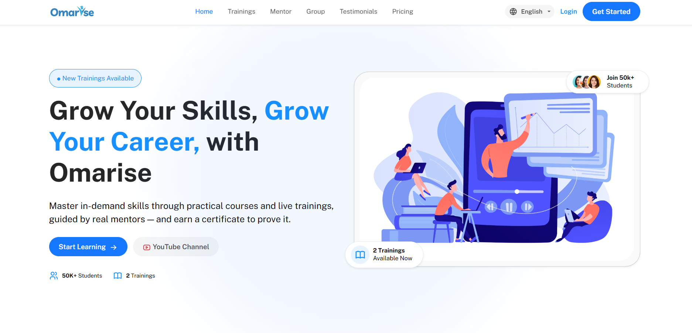
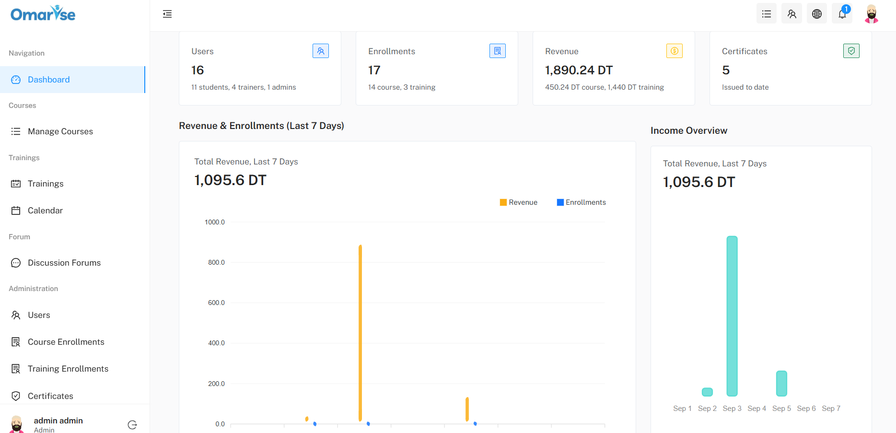
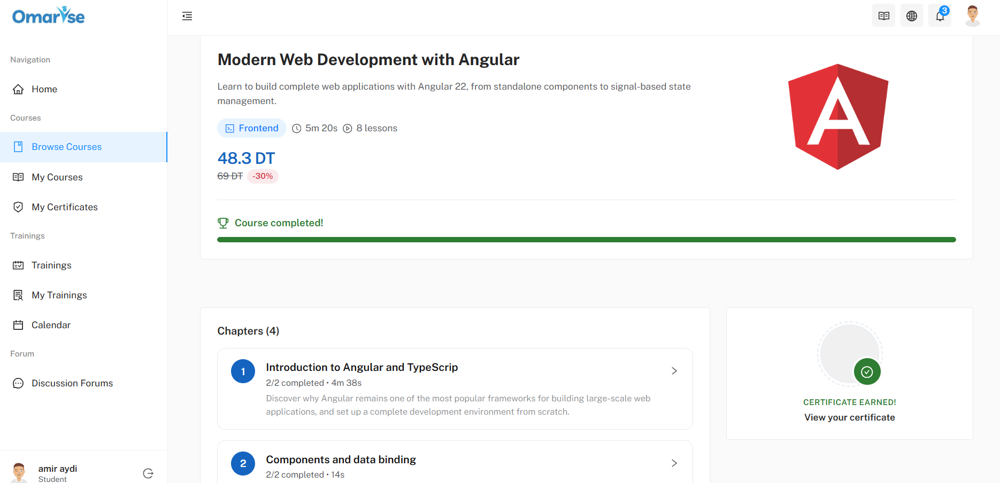
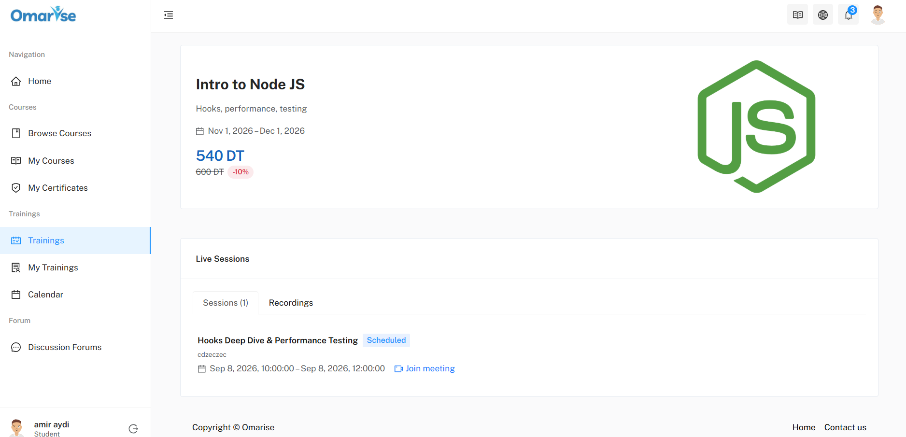
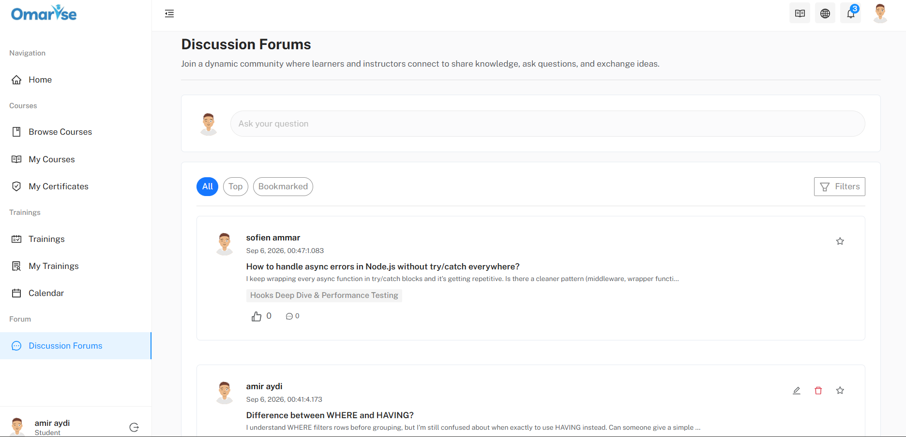

# OMARISE — Frontend

[](./LICENSE)
[](https://angular.dev)
[](https://getbootstrap.com)

OMARISE is an e-learning platform for taking online courses, joining live training sessions (live sessions and recordings), discussing on a forum, and receiving real-time notifications. This repository contains the **Angular frontend** of the platform.



## Table of contents

- [Tech stack](#tech-stack)
- [Prerequisites](#prerequisites)
- [Installation and running](#installation-and-running)
- [Internationalization](#internationalization)
- [User roles](#user-roles)
- [Features](#features)
- [Demo accounts](#demo-accounts)
- [Known limitations](#known-limitations)
- [Credits](#credits)
- [License](#license)

## Tech stack

- **Angular 22** — standalone components, no NgModules for feature code (only `AppRoutingModule` remains an NgModule), `provideZonelessChangeDetection()` (no Zone.js), lazy-loading via `loadComponent` on every route
- **TypeScript 6.0**
- **Bootstrap 5.3** + [@ng-bootstrap/ng-bootstrap 20](https://ng-bootstrap.github.io/) for UI components (modals, dropdowns, etc.)
- **@ngx-translate/core 18** + **@ngx-translate/http-loader 18** for i18n (JSON files loaded from `/assets/i18n/`)
- **@ant-design/icons-angular 21** for icons
- **ApexCharts 5** / **ng-apexcharts 2.4** for the dashboard charts
- **FullCalendar 6** (`@fullcalendar/angular`, `core`, `daygrid`, `interaction`, `timegrid`) for the training calendar
- **jsPDF 4** + **html2canvas 1.4** for generating certificate PDFs
- **ngx-scrollbar 19**
- **RxJS 7.8**
- **ESLint 10** + **Prettier 3.8** for linting/formatting

This frontend is built on top of the free **[Mantis Angular Admin Template](https://github.com/codedthemes/mantis-free-angular-admin-template)** (CodedThemes) — see the [Credits](#credits) section.

## Prerequisites

- **Node.js v24.19.0**
- **npm** (bundled with Node.js)
- The **OMARISE backend** must be running first (or alongside) the frontend — repository: [e-learning-backend](https://github.com/Sa3id-Boubaker/e-learning-backend). Refer to that repository for how to install and start it; by default, the frontend expects it on `http://localhost:8080`.

## Installation and running

```bash
npm install
ng serve
```

The application is then available at `http://localhost:4200`.

> **Note on the proxy**: in development, `ng serve` uses [`proxy.conf.json`](./proxy.conf.json) to forward `/api` calls to `http://localhost:8080`. If your backend runs at a different address, update the target in `proxy.conf.json` **and** the `apiUrl` value in [`src/environments/environment.ts`](./src/environments/environment.ts) (used for flows that don't go through the proxy, such as real-time notifications via `EventSource`). Do the same in [`src/environments/environment.prod.ts`](./src/environments/environment.prod.ts) for a production build.

## Internationalization

The application is available in **English (en)**, **French (fr)** and **Arabic (ar)**, with full RTL support for Arabic.

- Translation files: [`src/assets/i18n/en.json`](./src/assets/i18n/en.json), [`fr.json`](./src/assets/i18n/fr.json), [`ar.json`](./src/assets/i18n/ar.json)
- Language handling lives in `LanguageService` ([`src/app/theme/shared/service/language.service.ts`](./src/app/theme/shared/service/language.service.ts)), built on Angular **signals**:
  - the chosen language is persisted in `localStorage` (key `omarise-lang`);
  - it is applied at application startup (before the first render, via a `provideAppInitializer` in `main.ts`) to avoid any flash of the wrong language/direction;
  - `<html lang>` and `<html dir>` are updated automatically (`dir="rtl"` for Arabic, `dir="ltr"` otherwise).
- A language switcher is available in the UI (user menu / header) and lets you switch between the three languages at any time.

## User roles

The interface adapts to the signed-in account's role (`ADMIN`, `FORMATEUR`, `ETUDIANT`) — the navigation menu dynamically filters visible sections based on role (see `NavContentComponent.filterByRole`). For example, user management and admin-level enrollment views are only visible to an `ADMIN`, while creating courses/trainings is reserved for a `FORMATEUR`.

## Features

### Authentication

- Sign in / sign up
- Email verification
- Forgot password → reset code verification → password reset
- Forced password change (on first login, enforced via a dedicated HTTP interceptor)
- Google Sign-In (Google Identity Services)

### Dashboard



Role-aware dashboard aggregating statistics on courses, trainings, enrollments, certificates, and (for an administrator) platform users, shown as charts (ApexCharts) and lists (most popular courses/trainings, recent activity, etc.).

### Courses



- Course catalog, a student's library of enrolled courses, and course management for trainers
- Courses structured into chapters and videos
- Quizzes (taking a quiz, and creation/management by trainers)
- Completion certificates: viewing, PDF export, and public verification by certificate number (accessible without logging in)
- Enrollment management and enrolled-student lists per course, with discounts/promo codes

### Trainings (live sessions)



- Training list, a student's enrolled trainings, and creation/editing for trainers
- Scheduled live sessions, with associated recordings
- Session calendar (FullCalendar)
- Enrollment management and enrolled-student lists per training

### Forum



- List of discussion threads, creating new topics
- Thread detail view with a comment thread

### Notifications

- Real-time notifications via **Server-Sent Events (SSE)** — the connection opens on login, closes on logout, with automatic reconnection handled by the browser
- Notification bell in the header + a dedicated page listing notification history

### Administration

- User management (roles, creating trainer/student accounts)
- Managing course and training enrollments

### Profile

- Viewing/editing the profile, changing password

## Demo accounts

This frontend repository does not hardcode any demo account or password. To create test accounts (admin, trainer, student), refer to the [OMARISE backend](https://github.com/Sa3id-Boubaker/e-learning-backend).

## Known limitations

- **No route guards on the frontend**: no route is protected by an Angular `CanActivate`/`AuthGuard` (confirmed in `app-routing.module.ts`) — access control relies on HTTP interceptors and the backend, not on navigation itself. Any URL can therefore be reached directly in the browser, even though the data actually shown still depends on what the API allows.
- **Leftovers from the original template**:
  - Demo folders from the Mantis template unrelated to OMARISE are still present under `src/app/demo/` (e.g. `admin-panel`, `application`, `chart`, `table`, `widget`, `forms`, `layouts`, `pages`, `component/advance-component`), but they are **not** referenced in `app-routing.module.ts` — only the `typography`, `color`, and `sample-page` pages from `demo/` remain actually routed.
  - Several `README.md` files promoting the Pro version of Mantis remain in the code (e.g. `src/app/theme/shared/directive/README.md` and various `src/app/demo/**/README.md`).
  - The `.github/workflows/prod.yml` workflow is still the original template's: it deploys to CodedThemes' own infrastructure (`mantisdashboard.com`) on every merge to `master`, and has nothing to do with deploying OMARISE.
- **Two lockfiles** are present (`package-lock.json` and `yarn.lock`); this README assumes npm is used.

## Credits

This project's UI is built on top of the free **[Mantis Angular Admin Template](https://github.com/codedthemes/mantis-free-angular-admin-template)**, developed by [CodedThemes](https://codedthemes.com/) and distributed under the MIT license. The original [LICENSE](./LICENSE) file is kept unchanged.

## License

See the [LICENSE](./LICENSE) file (MIT).
